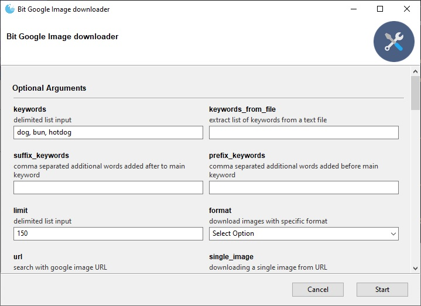

# Goolge Image Downloader

## Usage
1. Download realesed version from [release page](https://github.com/bit-dome/google-images-download/releases).  
2. Download [ChromeDriver](https://chromedriver.chromium.org/downloads) with match your Google Chrome version.  
3. Open bit_google_images_downloader.exe  

## Building
1. edit path in build.spec
2. pyinstaller build.spec
3. copy chromedriver.exe to dist folder
